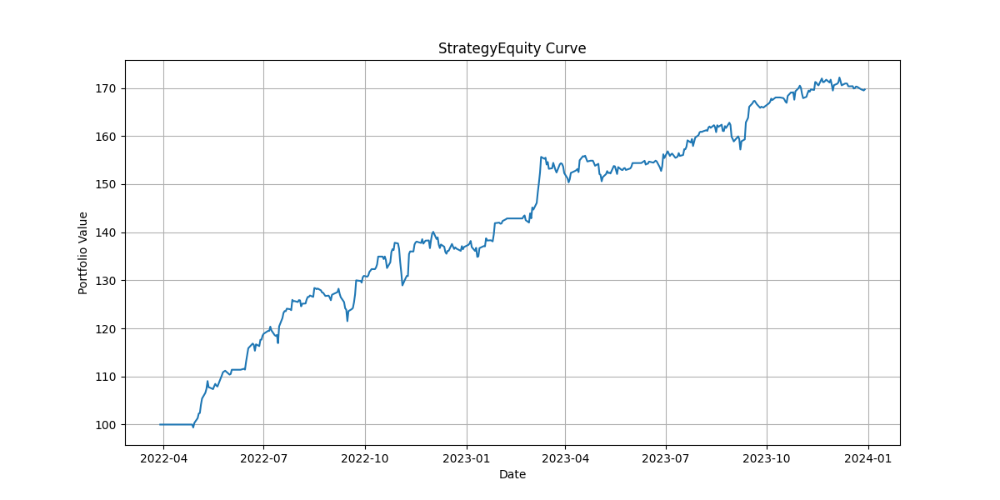
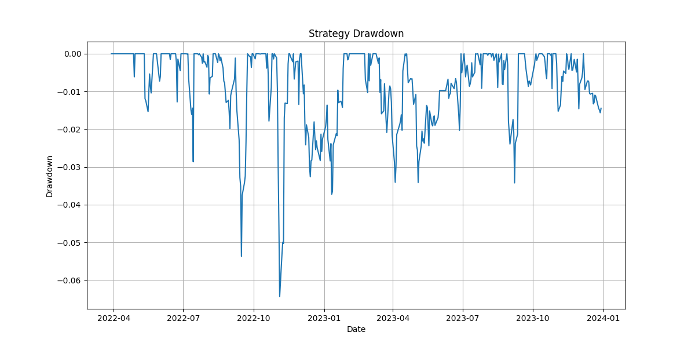
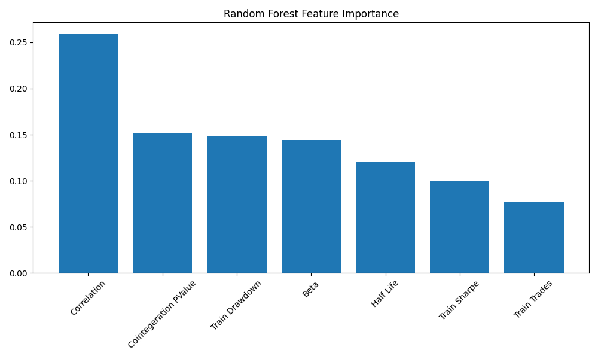

# Statistical Arbitrage Research Platform

## Overview

A quantitative research platform for discovering, ranking, backtesting, and evaluating statistical arbitrage opportunities using pairs trading.

The project identifies cointegrated stock pairs, constructs mean-reverting spreads, generates trading signals using z-score deviations, evaluates performance through backtesting, ranks candidate pairs using multiple quantitative metrics, and applies machine learning to investigate which pair characteristics are most predictive of future performance.

---
## Sample Outputs

| Equity Curve | Drawdown |
|-------------|----------|
|  |  |

| Feature Importance |
|---------|-------------------|
|  |

## Features

### Data Pipeline

- Historical price data collection
- Multi-asset universe support
- Train/Test data split for out-of-sample validation

### Statistical Arbitrage Research

- Correlation analysis
- Cointegration testing (Engle-Granger)
- Hedge ratio estimation using OLS regression
- Spread construction
- Stationarity testing (ADF Test)
- Half-life estimation of mean reversion

### Trading Strategy

- Rolling z-score calculation
- Mean reversion signal generation
- Long/Short spread positions
- Position management with entry/exit thresholds
- Look-ahead bias prevention through signal shifting

### Backtesting Engine

- Daily strategy return calculation
- Trade extraction and logging
- Equity curve construction
- Sharpe ratio calculation
- Maximum drawdown analysis
- Win rate and trade statistics

### Pair Ranking System

Pairs are ranked using a composite research score based on:

- Sharpe Ratio
- Maximum Drawdown
- Mean-Reversion Half-Life
- Trade Frequency

This enables systematic selection of the most promising statistical arbitrage candidates.

### Walk-Forward Validation

The strategy is evaluated using:

- In-sample (Training) period
- Out-of-sample (Testing) period

to assess robustness and reduce overfitting risk.

### Machine Learning Analysis

Feature engineering is performed on each pair:

- Correlation
- Cointegration p-value
- Hedge Ratio
- Half-Life
- Training Sharpe Ratio
- Training Drawdown
- Number of Trades

A Random Forest Regressor is then trained to predict out-of-sample Sharpe ratio and analyze feature importance.

---

## Project Structure

```text
stat_arb_platform/
│
├── data/
│
├── results/
│   ├── plots/
│   ├── cointegrated_pairs.csv
│   ├── ranked_pairs.csv
│   ├── walkforward_results.csv
│   ├── ml_dataset.csv
│   └── feature_importance.csv
│
├── src/
│   ├── data_loader.py
│   ├── correlation.py
│   ├── cointegration.py
│   ├── signals.py
│   ├── signal_generator.py
│   ├── trade_log.py
│   ├── performance.py
│   ├── research_engine.py
│   ├── ranking.py
│   ├── feature_engineering.py
│   ├── ml_model.py
│   ├── reporting.py
│   ├── plots.py
│   └── main.py
│
├── requirements.txt
├── README.md
└── .gitignore
```

---

## Research Workflow

```text
Price Data
    ↓
Correlation Analysis
    ↓
Cointegration Testing
    ↓
Spread Construction
    ↓
Stationarity Validation
    ↓
Signal Generation
    ↓
Backtesting
    ↓
Pair Ranking
    ↓
Walk-Forward Testing
    ↓
Feature Engineering
    ↓
Machine Learning Analysis
```

---

## Example Performance Metrics

For each pair the platform computes:

- Sharpe Ratio
- Maximum Drawdown
- Total PnL
- Win Rate
- Number of Trades
- Half-Life

Example output:

| Pair | Sharpe | Max Drawdown | Trades |
|--------|---------|-------------|---------|
| HD-WFC | 1.52 | -17.0% | 10 |
| MA-V | 1.47 | -8.4% | 8 |
| JPM-V | 0.91 | -9.9% | 10 |

---

## Machine Learning Results

A Random Forest model is trained using pair-level statistical features.

Feature importance analysis suggests that:

- Correlation
- Cointegration Strength
- Drawdown Characteristics
- Hedge Ratio

are among the strongest predictors of future out-of-sample performance within the tested universe.

---

## Technologies Used

- Python
- Pandas
- NumPy
- Statsmodels
- Scikit-Learn
- Matplotlib

---

## Key Concepts Implemented

- Statistical Arbitrage
- Pairs Trading
- Cointegration
- Mean Reversion
- Ordinary Least Squares (OLS)
- Augmented Dickey-Fuller Test
- Walk-Forward Testing
- Feature Engineering
- Random Forest Regression
- Quantitative Research

---

## Future Improvements

- Dynamic hedge ratios using rolling regression
- Kalman Filter spread estimation
- Transaction cost modeling
- Slippage simulation
- Position sizing framework
- Multi-pair portfolio construction
- Hyperparameter optimization
- XGBoost and LightGBM models
- Live paper-trading integration

---

## Disclaimer

This project is intended for research and educational purposes only and should not be considered financial advice.

```
