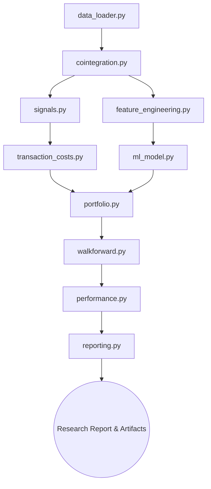

# Statistical Arbitrage Research Platform

## Overview

This project is a statistical arbitrage research platform built to explore cointegration-based pairs trading strategies and machine learning-based pair selection.

The platform identifies cointegrated stock pairs, constructs market-neutral spreads, generates mean-reversion trading signals, and evaluates strategy performance after accounting for transaction costs.

In addition to traditional statistical arbitrage techniques, the project includes a machine learning pipeline with time-series feature engineering, model comparison, and walk-forward validation to study whether ML-based ranking can improve pair selection.

## Research Objectives

The main goals of this project are:

- Identify cointegrated stock pairs using statistical tests rather than relying only on correlation.
- Construct market-neutral spreads using hedge ratios estimated from historical data.
- Generate and evaluate mean-reversion trading signals.
- Incorporate realistic transaction costs into the backtesting process.
- Build time-series features that capture spread dynamics and market conditions.
- Compare traditional statistical arbitrage methods with machine learning-based approaches.
- Evaluate strategy robustness using out-of-sample and walk-forward testing.

## System Architecture

### Module Responsibilities
- `data_loader.py`: Fetches and preprocesses daily closing prices for the equity universe.
- `cointegration.py`: Executes ADF tests and computes OLS hedge ratios.
- `signals.py`: Generates entry and exit triggers based on standard z-score boundaries.
- `feature_engineering.py`: Computes rolling time-series features (volatility, momentum, stationarity, distribution skew) devoid of look-ahead bias.
- `ml_model.py`: Orchestrates the training, cross-validation (`TimeSeriesSplit`), and calibration (`CalibratedClassifierCV`) of ML models (Logistic Regression, Random Forest, XGBoost).
- `transaction_costs.py`: Models execution friction based on traded notional exposure.
- `portfolio.py`: Allocates capital evenly across top-ranked pairs to construct aggregate equity curves.
- `walkforward.py`: Implements rolling train-test windows to validate strategy robustness against regime shifts.
- `performance.py`: Calculates core portfolio metrics including Sharpe Ratio, Max Drawdown, and cumulative returns.
- `reporting.py`: Generates publication-style markdown reports and renders analytical plots.

## Methodology

### Pair Selection

Instead of relying only on correlation, candidate pairs are tested for cointegration. A spread is constructed between two assets using the estimated hedge ratio, and the resulting residual series is evaluated using the Augmented Dickey-Fuller (ADF) test.

Pairs with an ADF p-value below 0.05 are considered cointegrated and are selected as candidates for mean-reversion trading.

### Spread Construction
The spread is constructed using the estimated hedge ratio: ($\beta$):
$$ \text{Spread}_t = \text{Asset1}_t - (\beta \times \text{Asset2}_t) $$

### Signal Generation
Signals are generated when the spread deviates from its historical mean:
- **Entry Thresholds**: Enter Long when Z-Score < -2.0; Enter Short when Z-Score > 2.0.
- **Exit Thresholds**: Exit positions when the Z-Score crosses 0 (reversion to the mean).

### Transaction Cost Model
Transaction costs are explicitly deducted on every portfolio turnover event to prevent unrealistic scaling assumptions. Costs are applied against the **traded notional** (the combined absolute exposure of the long and short legs adjusted by $\beta$).
- **Commission**: 1 basis point per trade.
- **Bid-Ask Spread**: 2 basis points (applied on entries and exits).
- **Slippage**: 2 basis points simulating execution delay.

### Feature Engineering
The machine learning pipeline uses a set of rolling time-series features designed to capture spread behavior, volatility, relationship stability, and mean-reversion dynamics.
- **Spread Features**: Spread, Spread Return, Z-Scores (20, 60 days), Momentum (5, 20 days).
- **Volatility Features**: Rolling Volatility (20, 60 days), Realized Volatility.
- **Mean Reversion Features**: Rolling Half-Life, Distance from Equilibrium.
- **Relationship Features**: Rolling Correlation (20, 60 days), Rolling Beta, Hedge Ratio.
- **Stationarity Features**: Rolling ADF Statistic, Rolling ADF P-Value.
- **Distribution Features**: Rolling Skewness, Rolling Kurtosis.

### Machine Learning Framework

The project compares several machine learning models:

- Logistic Regression (baseline model)
- Random Forest
- XGBoost

To avoid look-ahead bias, all models are evaluated using chronologically ordered TimeSeriesSplit cross-validation.

Model outputs are calibrated using Isotonic Regression and used to rank pairs by their predicted probability of spread convergence.

The prediction target is whether a spread reverts meaningfully toward its long-run mean within a fixed future horizon.

### Portfolio Construction
Pairs are ranked daily. For the fundamental approach, pairs are ranked by lowest cointegration p-value. For the ML approach, pairs are ranked by the calibrated probability of convergence. Capital is allocated equally to the top 5 pairs to construct the aggregate portfolio.

## Validation Framework

To reduce the risk of overfitting and look-ahead bias, the project uses several validation techniques:

- Train/Test separation
- TimeSeriesSplit cross-validation
- Walk-forward testing
- Transaction-cost-adjusted performance evaluation

These methods help evaluate whether strategy performance remains stable outside the training period.

## Experimental Results

The platform was evaluated on a universe of 20 large-cap U.S. equities using daily data from 2022–2024.

- **Research Portfolio (Rule-Based)**
  - Sharpe Ratio: ≈ 2.57
  - Max Drawdown: ≈ -6.6%

- **Machine Learning Portfolio**
  - Sharpe Ratio: ≈ 0.70
  - ROC-AUC (Out-of-Sample): ≈ 0.57

- **Walk-Forward Validation**
  - Average Test Sharpe: ≈ 2.66

## Key Findings

- The cointegration-based portfolio achieved stronger performance than the machine learning portfolio during the testing period.
- Time-series feature engineering improved ML performance compared with earlier versions that used only pair-level summary statistics.
- Incorporating transaction costs reduced performance, but the overall strategy remained profitable after costs.
- Walk-forward testing produced consistently positive results across multiple test windows, providing additional confidence in the robustness of the strategy.
- Machine learning was able to identify useful signals, but the traditional statistical arbitrage approach remained the stronger performer in this study.

## Limitations
- **Static OLS hedge ratios**: Hedge ratios are estimated using a static OLS approach and are not updated dynamically through time, which can lead to divergent legs if the relationship decays intraday.
- **No borrow-cost modeling**: The platform does not deduct short-selling borrow fees or model hard-to-borrow constraints.
- **Limited universe size**: Execution was benchmarked against a small subset of 20 mega-cap tech and financial equities.
- **Daily-frequency execution**: Market-on-Close daily assumptions ignore intraday slippage, gap risks, and high-frequency noise.

## Future Work

Possible future extensions include:

- Dynamic hedge ratio estimation using Kalman Filters.
- Expanding the stock universe beyond the current set of large-cap equities.
- Expanding the feature set with additional market, volatility, and regime-based indicators.
- Exploring alternative portfolio construction and position sizing approaches.
- Improving execution modeling through more realistic assumptions about order execution and trading costs.
- Investigating additional machine learning methods and feature sets for spread prediction.
